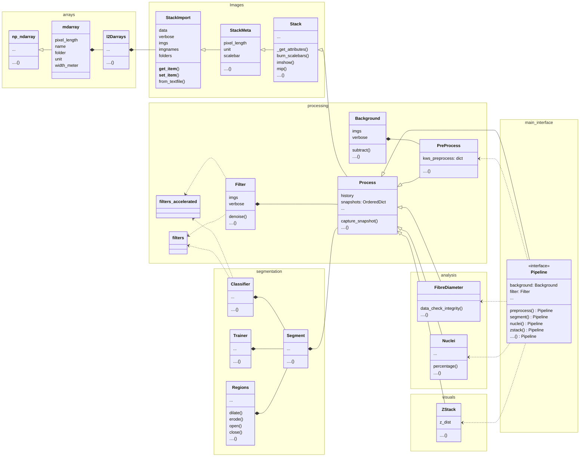

# ImageP: Image Analysis Pipelines in Python.
**Yes, this is a rip-off of ImageJ/Fiji. It's trying to achieve the same
thing (but easier): Scientific image processing and analysis processing with a
focus on (but not limited to) microscopy.**

## Install
```bash
pip install git+https://github.com/markur4/ImageP
```

## Why ImageP?

#### Differences to ImageJ/Fiji:
- **100% Python**
- **Automation:** Focus on batch processing
- **FAST:** Time costly filters are parallelized and cached to prevent
  re-computation.
- **Flexible:** No 
- **Straightforward:** 
  - No Plugins, only
  - Active curation of the state-of-the-art tools: *There's 1 way to do things*
- **Comprehensive:** Every processing intermediate is saved and shown so that everyone can understand what's going on
- **Scientific:** Every step is documented and reviewable in the
  `history` attribute

#### I wrote this because:
- ImageJ/Fiji was always crashing
- I don't need graphical interfaces (but could be added)
- I like batch processing of LOTS of images


## Features

### Quality-Of-Life

#### `l2Darrays`: Image Stacks of Different Sizes/Types
The main data-bucket for storing images is the new class `l2Darrays` (list
of arrays). It's a python `list` storing several images in the form of
(2D) `numpy.ndarrays`. Basically, we replace the outermost dimension of
a 3D static array with a dynamic list. This allows storage of images of
different sizes and types. Our goal is that `l2Darrays` behaves equivalent
to `np.ndarray` (without caveats).
<!-- (with minimal caveats optimized for superior image processing capabilities).  -->

Most of `numpy` methods are implemented for
`l2Darrays` and work as expected (`.min()`/`.max()`, math operations,
comparisons, etc.). Don't worry, we keep the dynamic lists as efficient
as possible by always looping with [list-comprehensions](https://stackoverflow.com/questions/30245397/why-is-a-list-comprehension-so-much-faster-than-appending-to-a-list). 

#### Fast: Parallelization and Caching
We use filters that are time-costly. Since our main datatype is a list
of images, parallelization is implemented image-wise, while every image
profits from `numpy`'s vectorization. Furthermore, the results are cached
to the hard-drive, meaning that the same filter is not applied twice to
the same image. This means that changing parameters and re-running the
pipeline is a lot faster.

#### `mdarray`: Metadata per image
Remember when I said that `l2Darrays` store `numpy` arrays? Well, they do,
but we also implement a subclass `mdarray` (meta-data array) that
extends on `numpy` array by simply adding a few attributes like `name`,
`pixel_length`, `unit`, etc. This allows to store experimental metadata
per image, ensuring that every image is properly documented.

### Generalized Pipelines
I think that too much choice is confusing. ***There should be one *best*
way to do things.*** Hence, every pipeline consists of curated
algorithms that just do their job. These pipelines are highly automated
and meant to take care of tedious work, e.g. importing batches of
images.

**Every pipeline consists of these steps:**
1. **Image Import**
2. **Preprocessing**
3. **Segmentation** (skippable)
4. **Analysis and/or Visualization**

You will probably ***interact*** with ImageP via a class from the third or
fourth step of this pipeline. For example, if you want to segment
images, you would import the `Segmentation` class and use it to segment
your images. This is going to run everything before that (importing,
denoising, etc.). If you choose a class from analysis/visualization, it
will inherit and execute functions from segmentation (if it needs that)
using pre-configured parameters.

ImageP still retains ***flexibility*** by allowing every feature to be
switched off and sticking to the universal 3D `numpy` array as the main
data format to store images. That way you can always exit the pipeline
at every step and continue with other tools.

#### 1. Image Import
Import vast collections of images from a list of folders, providing
filename extension (`.png`, `.tiff`, `.txt`, etc.) and/or filename
patterns (`2024_*image*.png`) per folder. Default precision is set to
`np.float32`

#### 2. The PreProcessing-Pipeline
Some things just make everything better. For example, since noise makes
everything worse, we simply remove that first, using an algorithm that
perfectly retains textures. Hence, **every** pipeline inherits features
from the `Preprocessing` class pipeline and starts with those. The goal
is to equalize images to improve *every* kind further analysis. The
`preprocess` package currently employs these optional processing steps
(in this order):
1. Median filtering (If LOTS of noise...)
2. Denoise (non-local means)
3. Subtract Background
4. Normalize pixel values (0-1)

#### 3. Segmentation
This is necessary for complex analysis pipelines. 
   1. Pronounce features
      - Smoothen edges (median filter)
   2. Train Classifier
      1. Annotate region classes
      2. Train Model (Random-forest)
   3. Segment
      - Background Threshold
      - Random Forest Classification
   4. Postprocess Segmentation
      - Remove small objects
      - Fill holes
      - smoothen edges

#### 4. Analysis / Visualization (100% your choice)
Here's where the "plugins" character from Fiji starts. These are highly
specialized functionalities meant to be expanded in the future. The
`analyse` package contains pipelines to quantify image information e.g.
after segmentation. The current implementation includes:
- Measure Fiber Width
- *More to come...*

The `visualise` package contains tools to visualize complex image data.

- 3D
  - Volume Rendering
  - Animated .gifs
- *More to come...*


### Inheritance Tree
#### Internal Structure



### Main Interface: Pipeline
```mermaid
classDiagram
   direction LR
   namespace processing{
      class Process
      class Background
      class Filter
      class PreProcess
   }
   namespace segmentation{
      class Segment
      class Regions
   }
   namespace analysis{
      class FibreDiameter
      class Nuclei
   }
   namespace visuals{
      class ZStack
   }
   namespace main_interface{
      class Pipeline{
         <<interface>>
         snapshots: OrderedDict
         background: Background
         filter: Filter
         preprocess() Pipeline
         segment() Pipeline
         nuclei() Pipeline
         zstack() Pipeline
         ....() Pipeline
      }
   }
   %% Main Inheritance
   Process <|-- Pipeline
   %% Compositions of Tools
   Filter *-- Pipeline
   Segment *-- Pipeline
   
   %% Sub-Compositions added by executing Processes
   Background *-- Pipeline 
   Regions *-- Pipeline 
   
   %% Functions
   PreProcess <..  Pipeline
   FibreDiameter <..  Pipeline
   Nuclei <..  Pipeline
   ZStack <..  Pipeline

   %% ==================================================================
   %% Rough Structure of all dependencies
   Filter *-- Process
   Segment *-- Process
   Background *-- PreProcess
   Regions *-- Segment
   
   %% Processes
   Process <|--  PreProcess
   Process <|--  FibreDiameter
   Process <|--  Nuclei
   Process <|--  ZStack
   


